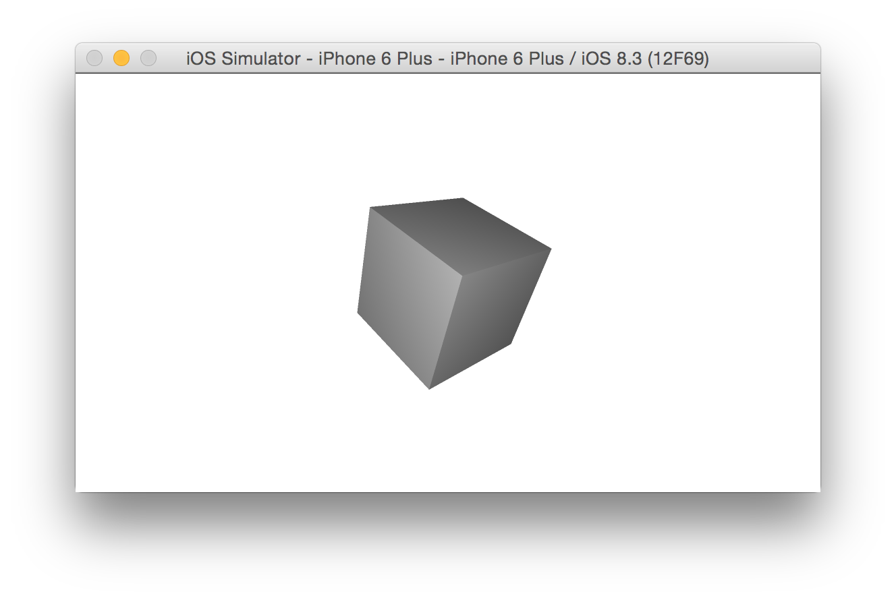

# Note on demo screenshots

To produce all of the screenshots for the different geometries, I have used this code.

```Swift
class ViewController: UIViewController {
    
    @IBOutlet weak var sceneView: SCNView!
    
    override func viewDidLoad() {
        super.viewDidLoad()
        
        let scene = SCNScene()
        
        let box = SCNBox(width: 10, height: 10, length: 10, chamferRadius: 0)
        
        let geometry = box // This is where you would change to different geometries
        let geometryNode = SCNNode(geometry: geometry)
        geometryNode.rotation = SCNVector4(x: Float(M_PI / 4), y: 1, z: 0, w: 1.0)
        scene.rootNode.addChildNode(geometryNode)
        
        // Camera
        let cameraNode = SCNNode()
        cameraNode.camera = SCNCamera()
        cameraNode.position = SCNVector3Make(0, 0, 30)
        scene.rootNode.addChildNode(cameraNode)
        
        sceneView.scene = scene
        sceneView.autoenablesDefaultLighting = true
        sceneView.allowsCameraControl = true
    }
}
```

# SCNGeometry

## Summary

This class represents 3D objects as a collection of: vertices, normals, texture coordinates. You attach geometries to SCNNode to define visual elements. SCNMaterial attach to geometries and determine appearance.

- You control the position of a geometry within a scene with a SCNNode.
- You control the texture, how it responds to light, special effects of a geometry with SCNMaterial objects.
- Vertex data is immutable.
- You can copy vertex data and change materials to create different models.
- You can animate a geometry using SCNMorpher and SCNSkinner. SCNShadeable protocol allows you to have custom GLSL shader programs.

## You can create geometries in 4 different ways

1. Load from scene file (SCNScene, SCNSceneSource)
1. Use and customize primitive shapes (SCNPlane, SCNBox, SCNSphere, SCNPyramid, SCNCone, SCNCylinder, SCNCapsule, SCNTube, SCNTorus)
1. Create 3D geometry from 2D text/bezier curvers (SCNText, SCNShape)
1. Create a custom geometry from vertex data (SCNGeometrySource, SCNGeometryElement)

# SCNBox

## Summary

A six-sided polyhedron whose faces are all rectangular. Corners can be rounded.


Size of the box is defined by these properties

- `width`
- `height`
- `length`

Corner rounding, or chamfer, is controlled by `chamferRadius`.

Since it has 6 faces, you can define 6 materials.

## Example

```Swift
let box = SCNBox(width: 10, height: 10, length: 10, chamferRadius: 0)
```



# SCNCapsule

## Summary

A circular cylinder with hemispheres at each end.


## Example

```Swift
let capsule = SCNCapsule(capRadius: 10, height: 30)
```

# SCNCone

## Summary

A right circular cone.


## Example

```Swift
let cone = SCNCone(topRadius: 0, bottomRadius: 10, height: 20)
```

# SCNCylinder

## Summary

A circular cylinder


## Example

```Swift
let cylinder = SCNCylinder(radius: 20, height: 20)
```

# SCNFloor

## Summary

Models an infinite plane, usually provides a background for a scene.


## Example

```Swift
let floor = SCNFloor()
```

# SCNPlane

## Summary

A one sided rectangular plane. Can have rounded corners.


## Example

```Swift
let plane = SCNPlane(width: 20, height: 20)
```

# SCNPyramid

## Summary

A right rectangular pyramid.


## Example

```Swift
let pyramid = SCNPyramid(width: 20, height: 30, length: 20)
```

# SCNShape

## Summary

Creates a 3D shape from a 2D path. You can also extrude the path.

## Example

```Swift
let shapePath = UIBezierPath()
shapePath.moveToPoint(CGPoint(x: 0, y: 0))
shapePath.addCurveToPoint(
    CGPoint(x: 20, y: 20),
    controlPoint1: CGPoint(x: 20, y: 0),
    controlPoint2: CGPoint(x: 20, y: 10))

let shape = SCNShape(path: shapePath, extrusionDepth: 10)
```

# SCNSphere

## Summary

Models a sphere.


## Example

```Swift
let sphere = SCNSphere(radius: 20)
```

# SCNText

## Summary

Renders text. You can also extrude the new text shape to make an object with depth.


## Example

```Swift
let text = SCNText(string: "Testing", extrusionDepth: 10)
```

# SCNTorus

## Summary

Models a torus (a ring shape).


## Example

```Swift
let torus = SCNTorus(ringRadius: 20, pipeRadius: 5)
```

# SCNTube

## Summary

A tube (circular cylinder with a circular hole in the middle).


## Example

```Swift
let tube = SCNTube(innerRadius: 5, outerRadius: 20, height: 20)
```

# SCNGeometryElement

## Summary

One of two classes used to create custom geometry from vertex data. This class is used to separate groups of vertices into materials. This allows you to assign different texture/color properties to those groups. An instance of this class is required when calling the initialiser of `SCNGeometry`.


## Example

```Swift
let vertexIndexArray: [CInt] = [0, 1, 2]
let data = NSData(bytes: vertexIndexArray, length: vertexIndexArray.count * sizeof(CInt));
let geometrySource = SCNGeometrySource()

let geometryElement = SCNGeometryElement(
    data: data,
    primitiveType: .Triangles,
    primitiveCount: vertexIndexArray.count / 3,
    bytesPerIndex: sizeof(CInt))

let geometryFromElement = SCNGeometry(sources: [geometrySource], elements: [geometryElement])
```

# SCNGeometrySource

## Summary

One of two classed used to create custom geometry from vertex data. This class is a container for all the vertices that define the shapes geometry.

## Example

```Swift
let vertexArray: [SCNVector3] = [
    SCNVector3(x: 0, y: 0, z: 0),
    SCNVector3(x: 10, y: 0, z: 0),
    SCNVector3(x: 10, y: 10, z: 0)
]

let geometrySource = SCNGeometrySource(vertices: vertexArray, count: vertexArray.count)

let geometryElement = SCNGeometryElement()
let geometryFromSource = SCNGeometry(sources: [geometrySource], elements: [geometryElement])
```
